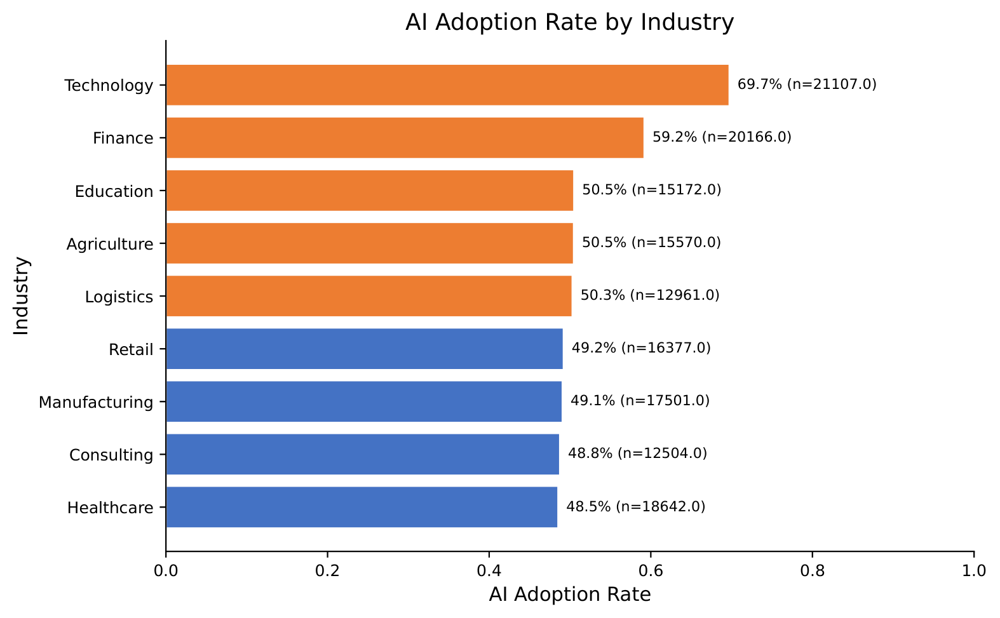
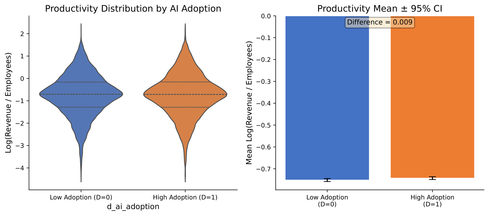
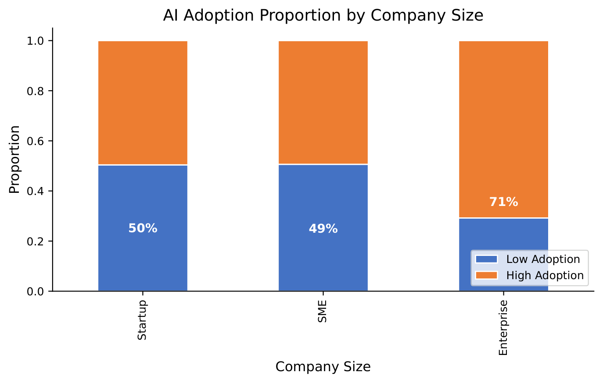
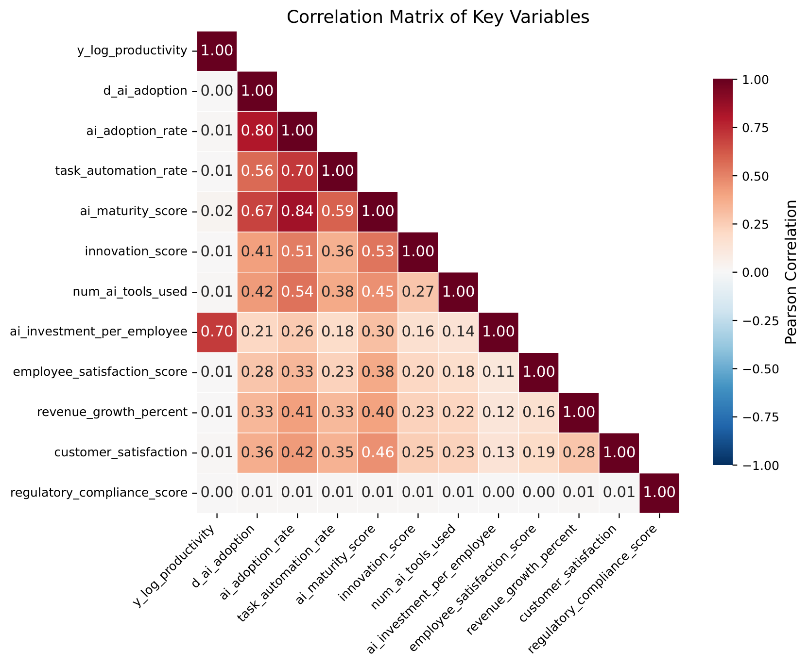
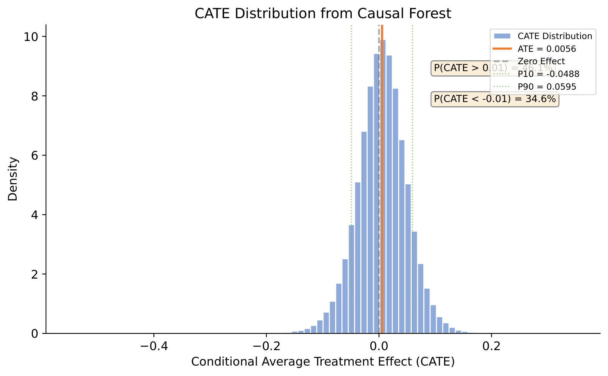
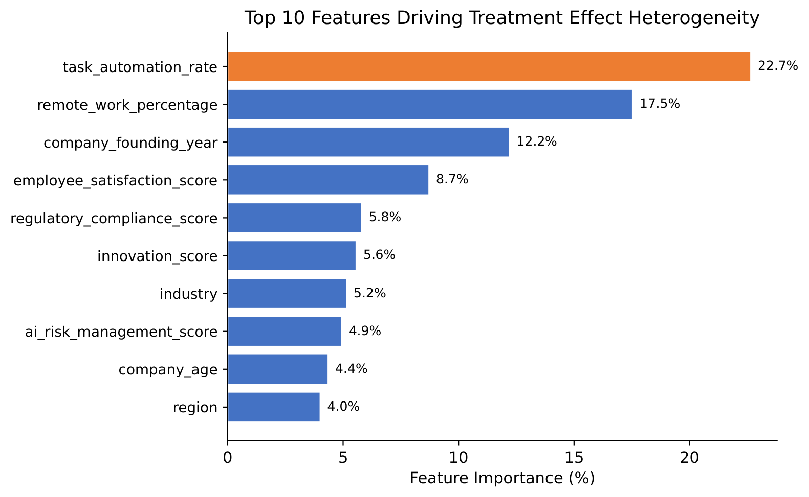
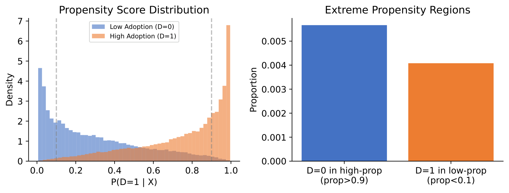
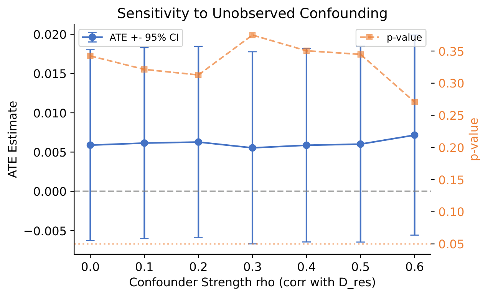
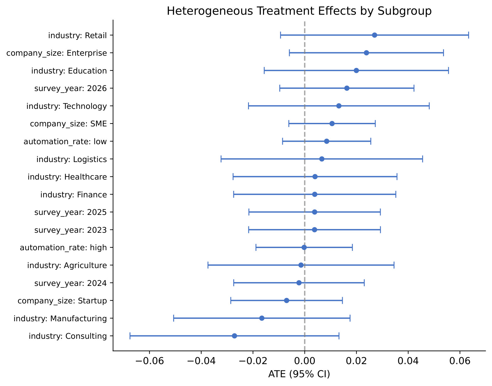

<div align="center">

# AI 采纳真的提升了企业生产率吗？

**基于双重机器学习（DML）与因果森林的 15 万家企业因果推断研究**

</div>

---

## 一句话结论

> 在 15 万家企业的微观数据上，用**双重机器学习**控制行业、国家、规模、自动化率等 64 维企业特征后，
> AI 采纳对劳动生产率的**平均因果效应为 +0.6%，统计上并不显著（p = 0.342）**。
> 但"平均无效"不等于"普遍无效"：**因果森林显示约 46% 的企业因 AI 获得正向效应、35% 承受负向效应**，
> 效应分化的主要驱动因素是自动化基础、远程办公比例与企业年龄等**互补性资产**。

完整论文见 [`report/paper.pdf`](report/paper.pdf)（中文，正文约 7 页 + 代码附录）。

---

## 目录

- [一、研究问题：为什么不能直接比较均值](#一研究问题为什么不能直接比较均值)
- [二、核心发现](#二核心发现)
- [三、方法原理](#三方法原理)
- [四、实证结果](#四实证结果)
- [五、项目结构](#五项目结构)
- [六、复现指南](#六复现指南)
- [七、这个项目体现了哪些能力](#七这个项目体现了哪些能力)
- [八、局限与后续计划](#八局限与后续计划)
- [九、参考文献与引用](#九参考文献与引用)
- [十、致谢与 AI 使用声明](#十致谢与-ai-使用声明)

---

## 一、研究问题：为什么不能直接比较均值

近三年企业端 AI 采纳率快速上升，"AI 到底能不能提升生产率"成为微观经济学的核心争议之一。但**直接比较采纳企业与未采纳企业会得到有偏结论**——因为采纳 AI 的企业本来就不一样。数据本身就展示了这种系统性差异：

| 维度 | 事实 | 含义 |
|------|------|------|
| 企业规模 | 大型企业采纳率 **70.8%**，中小企业 **49.4%**，初创企业 **49.6%** | 规模同时影响采纳决策与生产率 |
| 行业 | 技术业 **69.7%** vs 医疗业 **48.5%** | 行业是强混淆因素 |
| 变量结构 | 自动化率、AI 成熟度、创新评分等高度相关 | 混淆因素维度高且存在多重共线性 |

这意味着传统做法（线性回归 + 手工设定交互项）要么控制不足、要么陷入维度诅咒。本项目因此采用**双重机器学习（Double/Debiased Machine Learning, DML）**：用机器学习灵活估计高维非线性 nuisance 函数，同时用 **Neyman 正交评分**与**交叉拟合**保证因果参数的 $\sqrt{N}$-一致性与渐近正态推断。

<table>
<tr>
<td width="50%"></td>
<td width="50%"></td>
</tr>
<tr>
<td align="center"><b>图 1</b>　各行业 AI 采纳率（48.5%–69.7%）</td>
<td align="center"><b>图 2</b>　高/低采纳组的劳动生产率分布对比</td>
</tr>
</table>

<table>
<tr>
<td width="52%"></td>
<td width="48%"></td>
</tr>
<tr>
<td align="center"><b>图 3</b>　采纳比例随企业规模系统性上升</td>
<td align="center"><b>图 4</b>　关键变量相关性热图：强相关说明必须用 ML 灵活控制</td>
</tr>
</table>

**一个关键的描述性事实**：高采纳组与低采纳组的劳动生产率对数均值差**仅为 0.0088**（t = 1.82，未达 5% 显著水平）。朴素比较本就看不到明显差异，因此真正需要回答的是：**在精确控制企业特征后，这个微弱的关联是否由 AI 引起？**

---

## 二、核心发现

| 结论 | 证据来源 | 关键数值 |
|------|----------|----------|
| AI 采纳的平均效应接近于零且不显著 | 基准 DML（RF, K=5） | ATE = **+0.0059**，SE = 0.0062，p = **0.342** |
| 结论不依赖于 nuisance 模型的选择 | LASSO / RF / XGBoost 三法一致 | ATE ∈ [0.0004, 0.0059]，p > 0.3 |
| 结论不依赖于样本分割方式 | 交叉拟合 K = 2 / 5 / 10 | ATE ∈ [0.0051, 0.0059] |
| 仅"全面采纳"组效应显著为正 | 处理组仅 full（n = 1,685，占 1.1%） | ATE = **+0.0557**，p = **0.030** |
| 识别假设全部通过诊断 | 共同支撑 / 安慰剂 / 协变量平衡 / 遗漏变量灵敏度 | **4 / 4 通过** |
| 平均效应掩盖了剧烈异质性 | 因果森林 CATE 分布 | CATE 标准差 **0.044**（≈ ATE 的 8 倍）；P(CATE>0.01) = **46.1%**，P(CATE<−0.01) = **34.6%** |
| 异质性由互补性资产驱动 | 因果森林特征重要性 | 自动化率 **22.7%**、远程办公比例 **17.5%**、成立年份 **12.2%** |

<table>
<tr>
<td width="50%"></td>
<td width="50%"></td>
</tr>
<tr>
<td align="center"><b>图 5</b>　因果森林估计的个体处理效应（CATE）分布：宽尾分布、跨企业剧烈分化</td>
<td align="center"><b>图 6</b>　驱动处理效应异质性的前 10 位企业特征</td>
</tr>
</table>

> **一句话解读**：AI 的平均生产率效应接近于零，并不是因为 AI 普遍无效，而是因为**正负效应相互抵消**——具备自动化基础、灵活工作组织与低组织惯性的企业显著受益，而其余企业可能因调整成本（培训、流程重组、治理合规投入）在短期内受损。

---

## 三、方法原理

### 3.1 部分线性模型

采用部分线性模型（Partially Linear Model）刻画 AI 采纳与劳动生产率的关系：

$$
Y_i = \theta_0 D_i + g_0(X_i) + \varepsilon_i, \qquad D_i = m_0(X_i) + \nu_i
$$

其中 $Y_i = \log(\text{年营收}/\text{员工数})$ 为劳动生产率；$D_i$ 为 AI 采纳的二元处理变量（partial/full → 1，占 53.7%）；$X_i$ 为从 43 个原始字段中筛选出的 17 个**企业前定特征**（8 个数值 + 9 个类别，one-hot 后 64 维）；$\theta_0$ 即待估的平均处理效应（ATE）。

### 3.2 Neyman 正交评分与交叉拟合

DML 的核心是对部分线性模型构造 **Neyman 正交**评分函数：

$$
\psi(W;\theta,\eta) = \left(Y - \ell(X) - \theta\,(D - m(X))\right)\left(D - m(X)\right),
\qquad \ell(X)=\mathbb{E}[Y\mid X],\ m(X)=\mathbb{E}[D\mid X]
$$

该评分满足 $\partial\,\mathbb{E}[\psi(W;\theta_0,\eta_0)]/\partial\eta = 0$，即 nuisance 函数的估计误差对 $\theta_0$ 只有**二阶影响**，因此可以放心使用收敛较慢的机器学习估计 $\hat\ell,\hat m$。求解后得到残差化回归（partialling-out）形式的估计量：

$$
\hat\theta = \frac{\sum_i \tilde D_i \tilde Y_i}{\sum_i \tilde D_i^{2}},
\qquad \tilde Y_i = Y_i - \hat\ell(X_i),\quad \tilde D_i = D_i - \hat m(X_i)
$$

推断使用 **Eicker–Huber–White 稳健标准误**，并对样本做 **K = 5 折交叉拟合**（在 $K-1$ 折上训练 nuisance 模型，在第 $K$ 折上计算残差），以避免过拟合偏差。

> **工程选择**：基准估计量由项目**手写实现**（[`scripts/03_dml_estimation.py`](scripts/03_dml_estimation.py)），刻意**不调用 EconML 的 `LinearDML` 高层 API**——目的是让正交评分、逐折残差与稳健方差公式完全透明、可逐行核对。仅在异质性分析中使用 EconML 的 `CausalForestDML`（[`scripts/06_heterogeneity_analysis.py`](scripts/06_heterogeneity_analysis.py)）。

### 3.3 识别假设与诊断设计

因果解释依赖**条件独立性**（在 $X$ 下处理分配与潜在结果无关）与**共同支撑**。为检验其合理性，项目设计了四类诊断（[`scripts/05_diagnostics.py`](scripts/05_diagnostics.py)）：

| 识别假设 | 检验方法 | 结果 |
|----------|----------|------|
| 共同支撑 | 倾向得分分布与极端区域占比 | **PASS** — D=0 落在 prop>0.9 仅 0.6%，D=1 落在 prop<0.1 仅 0.4% |
| 无系统性偏误 | 安慰剂检验（随机置换 Y，重复 5 次） | **PASS** — 假阳性率 **0%** |
| Neyman 正交性 | 残差化前后 $\lvert\text{corr}(D,X)\rvert$ 对比 | **PASS** — 均值由 **0.233 降至 0.017** |
| 无遗漏变量偏误 | 构造与 $\tilde D$ 偏相关为 $\rho$ 的混淆变量 U | **PASS** — 即使 $\rho=0.6$，p 仍 > 0.27 |

<table>
<tr>
<td width="50%"></td>
<td width="50%"></td>
</tr>
<tr>
<td align="center"><b>图 7</b>　倾向得分分布（共同支撑）与极端区域占比</td>
<td align="center"><b>图 8</b>　未观测混淆变量的灵敏度分析</td>
</tr>
</table>

---

## 四、实证结果

### 4.1 基准结果

| 设定 | ATE | 标准误 | 95% 置信区间 | p 值 |
|------|-----|--------|--------------|------|
| **DML（Random Forest, K=5）** | **0.0059** | 0.0062 | [−0.0063, 0.0180] | **0.342** |
| 朴素均值差异（参照） | 0.0088 | 0.0048 | — | 0.069 |

在控制 64 维企业特征后，ATE 点估计对应约 **0.6%** 的生产率提升，但置信区间跨越 0。值得注意的是，朴素比较的差异本就微弱（0.0088），DML 进一步表明**这一微弱关联无法在因果意义上归因于 AI 采纳**。

### 4.2 稳健性检验

四项检验、六种替代设定（另含基准作为对照，[`scripts/04_robustness.py`](scripts/04_robustness.py)）：

| 检验维度 | 设定 | ATE | p 值 | 结论 |
|----------|------|-----|------|------|
| 更换 nuisance 模型 | LASSO（CV 选 λ） | 0.0004 | 0.948 | 不显著 |
| | XGBoost | 0.0042 | 0.519 | 不显著 |
| 改变交叉拟合折数 | K = 2 | 0.0058 | 0.354 | 不显著 |
| | K = 10 | 0.0051 | 0.407 | 不显著 |
| **替换处理变量定义** | **仅 full = 1** | **0.0557** | **0.030** | **显著为正** |
| 替换结果变量 | productivity_change (%) | 2.699 | <0.001 | 显著（但为主观回顾性指标） |

**三类性质迥异的机器学习方法给出高度一致的结论**，是结果稳健性的最强证据。唯一显著的设定是"仅全面采纳为处理组"，但该组仅 1,685 家（1.1%），标准误达 0.026，须谨慎解读。

### 4.3 多值处理效应：是否存在剂量—反应关系

将四分类采纳阶段以"无采纳"（n = 5,198）为参照组分别估计：

| 处理水平 | ATE | 标准误 | p 值 | 解读 |
|----------|-----|--------|------|------|
| 试验阶段（pilot） | −0.014 | 0.014 | 0.333 | 点估计为负，或反映导入期调整成本 |
| 部分采纳（partial） | +0.031 | 0.026 | 0.233 | 方向与理论预期一致但不显著 |
| 全面采纳（full） | +0.025 | 0.175 | 0.885 | 标准误过大，几乎不含信息量 |

点估计呈现**微弱的剂量—反应梯度**，但各水平均不显著，说明二元处理框架并未遗漏系统性的剂量效应。

### 4.4 异质性分析：子组切分与因果森林

**（1）传统子组切分**（9 个行业 + 3 类规模 + 4 个年份 + 2 组自动化率 = 18 个子组，森林图见 [图 9](output/figures/png/fig10_hte_forest.png)）。所有子组在 5% 水平上均不显著，但点估计揭示了几组有经济学含义的模式：

| 维度 | 子组 | ATE | p 值 |
|------|------|-----|------|
| 企业规模 | 大型企业 | +0.024 | 0.116（边际） |
| | 初创企业 | −0.007 | 0.525 |
| 行业 | 零售 | +0.027 | 0.145 |
| | 咨询 | −0.027 | 0.188 |
| 自动化率 | 高自动化 | −0.0002 | 0.982 |
| | 低自动化 | +0.008 | 0.329 |

**（2）因果森林（Causal Forest, Wager & Athey 2018）**。手动切分需事先选定维度、只能覆盖少数离散分组，无法自适应地在高维空间识别异质性。因此进一步用 `CausalForestDML` 在相同 64 维协变量下估计个体 **CATE**：

- CATE 均值 = 0.0056，与基准 ATE 吻合；
- **CATE 标准差 = 0.044，约为 ATE 的 8 倍**；P10/P90 = [−0.0488, 0.0595]；
- **46.1% 的企业 CATE > 0.01（正向），34.6% 的企业 CATE < −0.01（负向）**，仅约 19% 集中在零附近。



**图 9**　子组处理效应森林图（18 个子组，均不显著，符号分化）

值得注意的是，单维度切分显示高自动化企业效应约为零，而因果森林却把自动化率列为**最重要的异质性来源（22.7%）**——两者并不矛盾：前者只考察边际均值差异，后者在控制全部协变量的交互作用后识别非线性调节效应。

---

## 五、项目结构

```
ai-adoption-productivity-dml/
├── scripts/                          # 分析脚本（按编号顺序执行）
│   ├── 01_data_prep.py               # 数据清洗、D/Y 构造、协变量筛选
│   ├── 02_visualization.py           # 探索性图表（fig1–fig4）
│   ├── 03_dml_estimation.py          # 手写 DML 交叉拟合基准估计
│   ├── 04_robustness.py              # 稳健性：3 种 ML × 3 种折数 × 变量替换
│   ├── 05_diagnostics.py             # 四类内生性诊断（fig5–fig7 与灵敏度曲线）
│   ├── 06_heterogeneity_analysis.py  # 因果森林 CATE 与特征重要性
│   ├── 06b_subgroup_hte.py           # 多值处理效应与子组 HTE（fig10 森林图）
│   └── 07_export_figures_png.py      # 将 PDF 图表栅格化为 PNG（供 README 展示）
├── report/
│   ├── paper.tex                     # 中文 LaTeX 论文（ctexart，XeLaTeX 编译）
│   ├── appendix_code.tex             # 代码附录（含各脚本提示词）
│   └── paper.pdf                     # 编译后的论文
├── output/
│   ├── figures/                      # 出版级矢量图（PDF）+ README 用 PNG
│   └── tables/                       # 全部估计结果（CSV）
├── logs/
│   └── analysis_log.md               # 分析日志：逐脚本记录数值结果与解读
├── data/
│   └── raw/                          # 原始数据（不入版本库，见第六节下载）
├── requirements.txt
├── LICENSE                           # 代码 MIT；论文 CC BY 4.0
└── README.md
```

> **工作流设计**：脚本只负责"计算并落盘"，**不在代码里写分析结论**；所有结果解读集中记录在 [`logs/analysis_log.md`](logs/analysis_log.md)，论文正文再从日志中提炼。这样保证了"代码 → 数值 → 文字"的可追溯链条。

---

## 六、复现指南

### 环境要求

- Python **3.11**（开发环境：Anaconda `python31111`）
- 依赖见 [`requirements.txt`](requirements.txt)：`pandas`、`numpy`、`scipy`、`scikit-learn`、`xgboost`、`econml`、`matplotlib`、`seaborn`、`PyMuPDF`
- 论文编译（可选）：TeX Live / MiKTeX + XeLaTeX（`ctexart` 文档类）

### 步骤

```bash
# 1) 获取数据（需先配置 Kaggle API token）
kaggle datasets download \
  -d mohankrishnathalla/global-ai-adoption-and-workforce-impact-dataset \
  -p data/raw --unzip
# 脚本实际使用的文件：data/raw/ai_company_adoption.csv（约 150,000 行 × 43 列）

# 2) 安装依赖
pip install -r requirements.txt

# 3) 按编号顺序运行（每个脚本均可独立运行）
python scripts/01_data_prep.py            # 产出清洗数据与数据概览
python scripts/02_visualization.py        # 产出 fig1–fig4 图表
python scripts/03_dml_estimation.py       # 基准估计（实测约 4 分钟）
python scripts/04_robustness.py           # 稳健性检验
python scripts/05_diagnostics.py          # 诊断检验（含安慰剂重复，耗时较长）
python scripts/06_heterogeneity_analysis.py  # 因果森林（训练耗时较长）
python scripts/06b_subgroup_hte.py            # 多值处理与子组 HTE（含 18 个子组并行拟合）

# 4) 可选：导出 PNG 图表供 README / GitHub 页面展示
python scripts/07_export_figures_png.py

# 5) 可选：编译论文
cd report && xelatex paper.tex && xelatex paper.tex
```

### 可复现性措施

- **随机种子统一设为 42**（`RANDOM_SEED = 42`），所有含随机的步骤（K 折划分、RF/XGBoost、因果森林、安慰剂置换）均固定种子；
- 所有脚本使用**相对路径**定位项目根目录，可在任意工作目录下通过 `python scripts/xx.py` 运行；
- 全部估计结果**落盘为 CSV**（含标准误、置信区间、p 值与样本量），论文中的所有数值均可回溯到 `output/tables/`。

---

## 七、这个项目体现了哪些能力

| 能力维度 | 在本项目中的具体体现 | 对应产出 |
|----------|----------------------|----------|
| 因果推断理论 | 部分线性模型设定、Neyman 正交评分、交叉拟合、识别假设的条件与检验 | [`report/paper.tex`](report/paper.tex) 第 3 节 |
| 手写估计量实现 | 不依赖高层 API，手写 K 折交叉拟合与 Eicker–Huber–White 稳健标准误，并逐折检查残差方差 | [`scripts/03_dml_estimation.py`](scripts/03_dml_estimation.py) |
| 高维机器学习 | LASSO / Random Forest / XGBoost 三类 nuisance 模型的对照实验与超参数设定 | [`scripts/04_robustness.py`](scripts/04_robustness.py) |
| 异质性建模 | EconML `CausalForestDML` 个体 CATE 估计；将 one-hot 哑变量重要性**归并回原始变量**；18 个子组的并行 DML 估计与森林图 | [`06_heterogeneity_analysis.py`](scripts/06_heterogeneity_analysis.py)、[`06b_subgroup_hte.py`](scripts/06b_subgroup_hte.py) |
| 计量诊断 | 共同支撑、安慰剂（假阳性率）、协变量平衡、遗漏变量灵敏度四类诊断的自行设计 | [`scripts/05_diagnostics.py`](scripts/05_diagnostics.py) |
| 统计编程与数据工程 | 150,000 × 43 数据的清洗与变量构造；64 维 one-hot 协变量矩阵构建；全部估计结果结构化落盘 | `scripts/01`、[`logs/analysis_log.md`](logs/analysis_log.md) |
| 数据可视化 | matplotlib / seaborn 出版级图表（小提琴图、相关系数热图、CATE 密度图、森林图），矢量 PDF 输出 | `output/figures/` |
| 学术写作与排版 | 中文 LaTeX 论文：公式推导、三线表、矢量插图、参考文献、代码附录 | [`report/paper.pdf`](report/paper.pdf) |
| 可复现研究规范 | 固定随机种子、脚本编号与自包含设计、代码与分析文字严格分离、结果文件可回溯 | 全仓库 |

**给非技术读者的阅读路径**：本页 → [`report/paper.pdf`](report/paper.pdf)（约 10 分钟）→ [`logs/analysis_log.md`](logs/analysis_log.md)（逐脚本的数值记录与解读）→ `scripts/`（实现细节）。

---

## 八、局限与后续计划

项目在方法上尽力保持严谨，但仍有以下明确的局限与待办事项：

- **面板结构未被利用**：数据虽为 2023–2026 年面板，本文仅做混合截面分析，未使用企业固定效应控制不随时间变化的不可观测异质性。后续可拓展为固定效应 DML。
- **全面采纳样本严重不足**：`full` 阶段仅 1,685 家（1.1%），导致"仅全面采纳"设定的推断精度很低（SE = 0.026）、多值处理中该组标准误高达 0.175。
- **效应滞后性无法识别**：AI 的生产率回报可能需要数年才显现，截面设定无法刻画动态效应。
- **论文附录为节选**：附录 A 收录初始提示词、各脚本对应的提示词与首版实现代码，并非仓库中最终代码的完整副本；以 `scripts/` 为准。

---

## 九、参考文献与引用

项目以以下文献为方法基础：

1. Chernozhukov, V., Chetverikov, D., Demirer, M., Duflo, E., Hansen, C., Newey, W., & Robins, J. (2018). Double/debiased machine learning for treatment and structural parameters. *The Econometrics Journal*, 21(1), C1–C68.
2. Wager, S., & Athey, S. (2018). Estimation and inference of heterogeneous treatment effects using random forests. *Journal of the American Statistical Association*, 113(523), 1228–1242.
3. Syverson, C. (2011). What determines productivity? *Journal of Economic Literature*, 49(2), 326–365.
4. Bresnahan, T. F., Brynjolfsson, E., & Hitt, L. M. (2002). Information technology, workplace organization, and the demand for skilled labor. *Quarterly Journal of Economics*, 117(1), 339–376.

**引用本项目**：

```bibtex
@misc{ye2026aiadoptiondml,
  title  = {AI 会提升企业生产率吗：基于 DML 与因果森林的实证分析},
  author = {Yei1y},
  year   = {2026},
  note   = {Working paper},
  url    = {https://github.com/Yei1y/ai-adoption-productivity-dml}
}
```

**数据来源**：[Global AI Adoption & Workforce Impact Dataset](https://www.kaggle.com/datasets/mohankrishnathalla/global-ai-adoption-and-workforce-impact-dataset)（Kaggle，作者 Mohan Krishna Thalla）。原始数据不入版本库，请按第六节说明自行下载。

---

## 十、致谢与 AI 使用声明

本项目的**研究问题、变量设定（D、Y、X 的构造方式）、方法选择（部分线性模型 + 交叉拟合 + 因果森林）、稳健性检验方案与全部结果解读**均由作者本人设计完成；**代码实现、调试与文档整理**环节使用了 AI 编程助手（Claude Code / DeepSeek Harness）辅助。为便于审查，论文附录 A 保留了项目初始提示词与各脚本对应的提示词，`logs/analysis_log.md` 亦逐条记录了每次运行的数值输出与当时的判断依据。

**许可证**：本仓库代码（`scripts/`、`output/`、`logs/`、本文档）采用 [MIT 许可证](LICENSE)；论文（`report/`）采用 [CC BY 4.0](https://creativecommons.org/licenses/by/4.0/)。原始数据不随仓库分发，使用请遵循 [Kaggle 数据集](https://www.kaggle.com/datasets/mohankrishnathalla/global-ai-adoption-and-workforce-impact-dataset)的原始条款。引用请见第九节。

---

<div align="center">
<sub>研究问题：AI 采纳是否提升企业劳动生产率？ · 方法：Double/Debiased Machine Learning · 结论：平均效应不显著，但企业间效应剧烈分化</sub>
</div>